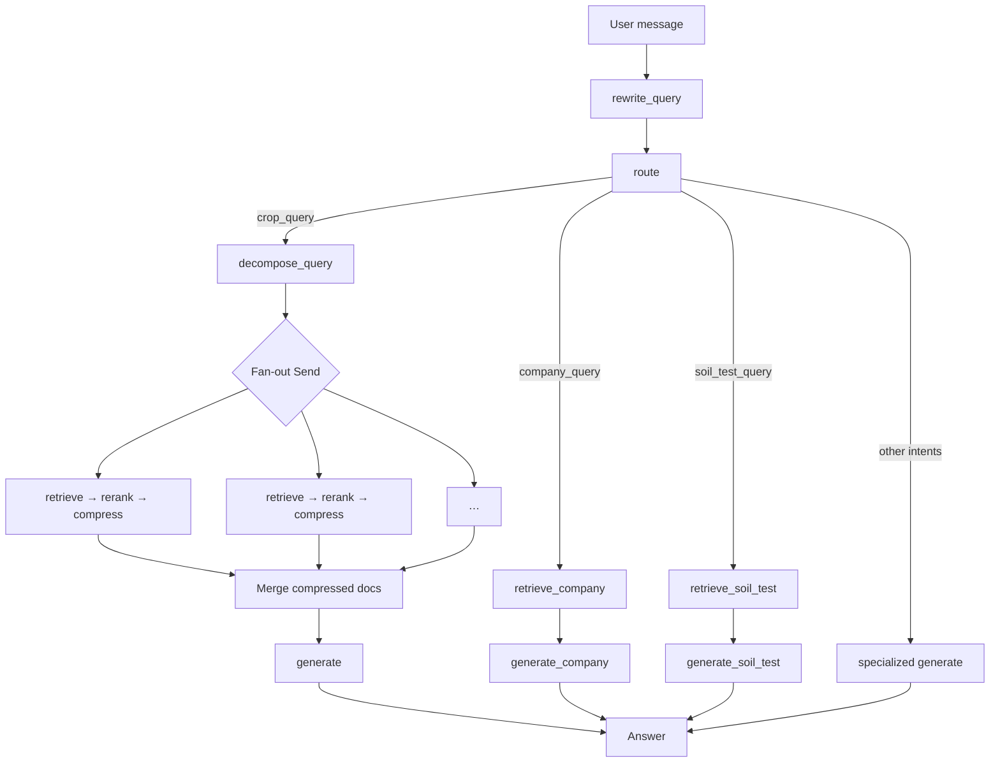

# Aunkur AI Chatbot — Technical Documentation

End-to-end documentation of the agricultural RAG chatbot for farmers in Bangladesh: problem context, data, infrastructure, evolution of each pipeline layer, and the current production architecture.

---

## 1. Background

### 1.1 Problem

The team needs a chatbot that farmers can use to ask farming-related questions and receive accurate, grounded answers. Questions cover crop production, varieties, pests, diseases, fertilizers, irrigation, harvesting, soil testing, and related topics. Answers must work primarily in **Bangla**, and also handle **Banglish** and **English** input.

### 1.2 Source data

Crop knowledge comes from an existing product website/backend via GraphQL (`getAllCropsFullDetails`). There are **52 verified crops**. Each crop is a nested JSON object that includes:

- Crop-level metadata (name, category, seasons, …)
- HTML-rich descriptive fields (sowing, harvesting, seed rate, soil, climate, …)
- Nested lists of **varieties**, **pests**, and **herbs/chemicals**, each with its own detailed Bangla text

Example (abbreviated) variety object:

```json
{
  "id": 349,
  "crop_id": 9,
  "variety_name": "বারি রসুন ৪ (BARI Rosun 4)",
  "avg_expected_yield": "34 Kg/Decimal",
  "seed_rate": "2500 gm/decimal",
  "duration_start": 130,
  "duration_end": 140,
  "special_character": "<p><strong>জাতের নাম :</strong>বারি রসুন-৪</p>..."
}
```

Additional knowledge sources:

| Source | Content | Collection |
|--------|---------|------------|
| GraphQL / `crops.json` | Crop sections, varieties, pests, herbs | `crop_knowledge_base` |
| Company Markdown | Organization / product info | `company_knowledge_base` |
| Porokh + soil FAQ CSVs | Soil sampling, reports, Porokh device Q&A | `soil_test_knowledge_base` |

### 1.3 Infrastructure constraints

| Constraint | Design impact |
|------------|----------------|
| **16 GB L4 GPU VM** | Full-precision Gemma 4 12B does not fit reliably → use a **quantized** chat model |
| **Cost for farmers** | Avoid frontier model APIs; self-host embeddings, chat, and reranking on the VM |
| **Concurrency** | Ollama’s typical free/local mode does not handle multiple concurrent chat requests well → serve chat with **vLLM** |
| **Bangla corpus** | Embeddings and chunks are Bangla; queries in Banglish/English need normalization before retrieval |
| **Context window** | vLLM setup is limited (~8192 tokens) → long chunks must be compressed before generation |
| **Proper names** | Variety, disease, and chemical names are unique strings → pure dense search is insufficient |

All model services (embeddings, vLLM chat, reranker) and Redis run on the hosted VM. The application connects to them over the network (SSH tunnel in local development).

---

## 2. Knowledge base construction

### 2.1 Why chunk by section and entity

A single crop row is too large and mixed to embed as one vector. Farmers ask about specific topics (“when to harvest”, “seed rate for BARI Rosun 4”, “pest X on boro”). The indexer therefore:

1. Cleans HTML from rich-text fields.
2. Creates **one chunk per crop section** (harvesting, seed, climate, …) with metadata (`crop_name`, `section`, `chunk_id`, …).
3. Creates **separate chunks for each variety, pest, and herb/chemical** so entity-specific questions can hit the right document.

### 2.2 Embedding and storage

- **Embedding model:** `bge-m3:latest` via Ollama  
- **Vector store:** Chroma  
- Inspectable JSONL dumps under `data/` support debugging; Chroma is the runtime index.

```text
GraphQL / local JSON / Markdown / CSV
        │
        ▼
  prepare_*  (clean + chunk)
        │
        ▼
  Ollama  bge-m3  embeddings
        │
        ▼
  Chroma  (crop | company | soil_test collections)
```

---

## 3. Runtime model stack

| Role | Choice | Reason |
|------|--------|--------|
| Embeddings | Ollama + `bge-m3` | Strong multilingual dense vectors; runs on the VM |
| Chat LLM | **vLLM** + quantized **Gemma 4 12B** | Concurrent request support; fits 16 GB L4 when quantized |
| Fallback chat | Ollama or Groq | Selected via `CHAT_PROVIDER` |
| Reranker | `BAAI/bge-reranker-v2-m3` (HTTP service) | Cross-encoder scores for (query, chunk) pairs |
| Memory | Redis or in-process MemorySaver | LangGraph checkpoints keyed by `session_id` |

**Quantization trade-off:** the model runs under memory limits but can occasionally produce vague phrasing or misspellings. Node-local, strict prompts and structured outputs are used to constrain behaviour.

---

## 4. Pipeline layers

Each layer was added to fix a concrete failure mode. Nodes are intentionally **narrow specialists**: each LLM call receives only the data it needs and is not told about other layers of the pipeline. That isolation is important for reliability on a quantized 12B model.

### 4.1 Basic RAG (starting point)

```text
User query → dense retrieve (Chroma) → LLM generate
```

**What worked**

- Simple path from question to grounded answer for clear, single-entity Bangla queries.

**What failed**

| Failure | Cause |
|---------|--------|
| Follow-up questions (“what about the dose?”) | No conversation state or coreference resolution |
| Banglish / English queries | Embeddings and documents are Bangla; query language mismatch |
| Exact variety / disease names missed | Dense similarity alone is weak on rare proper nouns |
| Greetings and gibberish | Every message paid the full retrieval + generation cost |
| Multi-entity questions | One mixed query dilutes retrieval for each entity |
| Context overflow / slow answers | Large section chunks filled the vLLM window |

The following sections describe each layer introduced to address these issues.

---

### 4.2 Query rewrite

**Why introduced**

Without rewrite, Banglish or English input and multi-turn pronouns did not match Bangla vectors. Follow-ups such as “তার জন্য সার কত দিতে হবে?” failed because the subject lived only in prior turns.

**What it does**

- Reads a **short** recent conversation history (history length is limited on purpose for latency and resource use).
- Resolves pronouns and coreferences into a standalone search query.
- Converts the query to **native Bangla script**.
- May append well-known English technical terms in parentheses (e.g. `পাতা পোড়া রোগ (Leaf Blast)`) to help dual-language documents.
- Must **not** change entity identity (must not turn one disease or variety into another).
- Does **not** answer the question.

**Outputs**

- `rewritten_query` for downstream retrieval  
- Clears previous turn’s document lists so state stays clean  

**Implementation:** `src/app/services/pipeline/nodes/rewrite_query.py`  
**State:** checkpointed via LangGraph using `session_id` as `thread_id`.

---

### 4.3 Intent router

**Why introduced**

Not every message is a crop question. Greetings (“hi”), capability questions (“what can you answer?”), company questions, soil-test / Porokh questions, agronomist handoff, and meaningless input should not run hybrid retrieval on the crop index.

**What it does**

Classifies the current message (with a small history window) into one of:

| Intent | Behaviour |
|--------|-----------|
| `crop_query` | Full crop RAG path (decompose → parallel retrieve/rerank/compress → generate) |
| `company_query` | Company collection retrieve → `generate_company` |
| `soil_test_query` | Soil-test collection retrieve → `generate_soil_test` |
| `chitchat` | Lightweight social reply |
| `capability_query` | Describes system coverage |
| `meaningless` | Safe rejection of gibberish |
| `request_agronomist` | HITL escalation when the user accepts an agronomist offer |

When uncertain but farming-related terms appear (including Banglish), the router prefers `crop_query`.

**Implementation:** `src/app/services/pipeline/nodes/route.py`

---

### 4.4 Hybrid retrieval (dense + BM25)

**Why introduced**

After rewrite improved language match, pure **semantic** search still missed many exact variety, pest, and chemical names. Those strings are rare in the embedding space; lexical match is required.

**What it does**

1. **Dense path:** Chroma similarity search (optional metadata filters on `crop_name` / `section`).  
2. **Lexical path:** BM25 (`rank_bm25.BM25Okapi`) over the same filtered corpus.  
3. **Merge:** union of both result sets, deduplicated by `chunk_id`.

Returns a candidate list larger than the final context budget (`RETRIEVAL_TOP_K`, default 20) for the reranker to score.

**Implementation:** `src/app/services/retrieval/hybrid.py`, `vector_store.py`

---

### 4.5 Reranker and score-based cutting

**Why introduced**

Hybrid retrieval returns many candidates. Passing all of them to the LLM is slow and noisy. A fixed top-k is brittle when score distributions change. A cross-encoder reranker assigns a relevance score to each (query, chunk) pair; post-processing then drops the tail without deleting important mid-ranked chunks.

**What it does**

1. Calls the external service `BAAI/bge-reranker-v2-m3` with the query and candidate passages.  
2. Attaches `relevance_score` on each document.  
3. Applies one of two cut policies (see code in `rerank.py`):

```text
scores sorted: s0 ≥ s1 ≥ … ≥ sn
gaps[i] = s[i] - s[i+1]

if max_gap >= median(other_gaps) * RERANK_GAP_MULTIPLIER:
    keep only documents before that unusual gap
else:
    keep documents with score >= s0 - RERANK_MIN_SCORE_DELTA
```

Defaults: `RERANK_GAP_MULTIPLIER = 60`, `RERANK_MIN_SCORE_DELTA = 0.65`.  
These thresholds were tuned so a sharp relevance cliff removes noise, while a smooth curve keeps a useful band of chunks.

**Implementation:** `src/app/services/pipeline/nodes/rerank.py`  
**Service:** HTTP reranker on the VM (`RERANKER_URL`).

---

### 4.6 Context compression

**Why introduced**

Even after reranking, section-level chunks are long. Broad questions pulled enough text to approach or exceed the **vLLM context limit (~8192 tokens)**, causing failures or truncated prompts. Sending full chunks also increased latency and diluted the generator’s attention.

**What it does**

- Uses LangChain’s **`LLMChainExtractor`** (contextual compression) with a custom prompt.  
- For each reranked chunk, extracts **only the spans that help answer the current question**, copied as-is.  
- Rules include:
  - Prefer complete sentences (not isolated numbers).  
  - Return `NO_OUTPUT` if the chunk is about a different crop, variety, or disease.  
  - For broad cultivation questions, keep practical steps, rates, timings, and warnings.  
- Re-attaches a short metadata prefix (crop, section, …) so entity identity is not lost after extraction.  
- On compressor failure, falls back to the reranked chunks.  
- Runs asynchronously; in the crop path it is part of each parallel branch.

Reference: [LangChain — Contextual compression](https://python.langchain.com/docs/how_to/contextual_compression/)

**Implementation:** `src/app/services/pipeline/nodes/compress_chunk.py`

---

### 4.7 Query decomposition and parallel fan-out

**Why introduced**

A single query that names **multiple entities** (e.g. three varieties, or two crops with the same disease) often retrieves poorly for each entity when issued as one mixed string. Retrieval needed to run **entity by entity**, then merge evidence for one final answer.

**What it does**

1. **`decompose_query`** splits **only by entity** (crops, varieties, pests, diseases, chemicals).  
2. It must **not** split by aspect alone (“when / how much fertilizer / can I use urea”).  
3. **Every subquery keeps the full shared context** (e.g. crop + disease) so the subject is never dropped.  
4. Single-entity queries return a one-element list (no unnecessary split).  
5. LangGraph **`Send`** fans out one branch per subquery. Each branch runs:

   `retrieve → rerank → compress`

   in parallel, with isolated document lists.  
6. Branch outputs merge via state reducers (`operator.add` on document lists).  
7. A single **`generate`** node answers from the merged compressed context.

**Implementation:** `decompose_query.py`, `graph.py` (`fan_out_subqueries`), `retrieve_and_rerank.py`

---

### 4.8 Answer generation

**Why introduced**

The final node must turn compressed evidence into a farmer-facing answer: correct language, grounded facts, no hallucinated rates, and no leakage of internal pipeline phrasing (“according to the provided information”).

**What it does**

- Answers **only** from supplied context; invents neither doses nor varieties.  
- Rejects context that is about a different crop/variety/disease than the question.  
- If context is missing or insufficient: polite “I don’t have that information” and offer to connect an agronomist.  
- Language locked to `language_type` (Bangla script / English / …); no mixed scripts.  
- Conversational expert tone; short by default; **step-by-step math** required for calculations.  
- Explicit ban on source-referencing phrases (including common Bangla variants).

Company, soil-test, chitchat, capability, and meaningless intents use dedicated generate nodes with the same grounding spirit but domain-specific prompts.

**Implementation:** `generate.py` and sibling `generate_*.py` nodes

---

### 4.9 Multi-turn memory (checkpoints)

**Why introduced**

Rewrite and route need prior turns. Without persistent state, every message is isolated.

**What it does**

- LangGraph checkpointer stores conversation and pipeline state per **`session_id`** (`thread_id`).  
- Backend: **Redis** (shared across workers) or **MemorySaver** (single process).  
- Only a short tail of history is passed into rewrite/route to control tokens and cost.

**Implementation:** `checkpointer.py`, FastAPI lifespan init

---

### 4.10 Company and soil-test paths

**Why introduced**

Company and Porokh/soil-test questions are different domains. Mixing them into the crop index reduces precision and complicates filtering.

**What it does**

- Separate Chroma collections and retrieve nodes (`retrieve_company`, `retrieve_soil_test`).  
- Smaller `top_k` defaults.  
- Dedicated generate nodes.  
- Router sends those intents directly, skipping crop decompose/fan-out.

---

## 5. End-to-end workflow

### 5.1 System diagram

```text
Farmer (mobile / web / Streamlit)
        │
        ▼
FastAPI  POST /api/v1/chat  |  /api/v1/chat/stream
        │
        ▼
ChatService  (per-session lock)
        │
        ▼
LangGraph + checkpointer
        │
        ├── rewrite_query
        ├── route
        │     ├── crop_query ──► decompose ──Send──► [retrieve → rerank → compress]×N ──► generate
        │     ├── company_query ──► retrieve_company ──► generate_company
        │     ├── soil_test_query ──► retrieve_soil_test ──► generate_soil_test
        │     └── chitchat / capability / meaningless / agronomist ──► specialized generate
        ▼
Answer (JSON or SSE)
```

### 5.2 Crop-path sequence



### 5.3 Parallel branch detail

For each subquery produced by decompose:

1. Hybrid retrieve (dense + BM25, optional crop/section filter)  
2. Rerank + gap/threshold cut  
3. LLM compress (async)  
4. Emit `compressed_documents` into the shared state (reducer merges branches)  

Then one generate call consumes the merged set.

### 5.4 Streaming

On `/api/v1/chat/stream`, the service:

- Acquires a per-session lock  
- Emits SSE **thinking** events keyed by node name (UX progress)  
- Streams answer tokens from the generate step  
- Uses the same checkpoint `thread_id` as non-streaming chat  

---

## 6. API

| Endpoint | Method | Description |
|----------|--------|-------------|
| `/api/v1/chat` | POST | Full graph; JSON response |
| `/api/v1/chat/stream` | POST | SSE thinking + answer tokens |
| `/health` | GET | Health check |

```json
{
  "message": "বোরো ধানে ব্যাকটেরিয়াল লিফ ব্লাইট হলে কী করব?",
  "session_id": "optional-uuid",
  "language_type": "bn"
}
```

---

## 7. Configuration (selected)

| Variable | Role |
|----------|------|
| `CHAT_PROVIDER` | `vllm` \| `ollama` \| `groq` |
| `VLLM_*` / `OLLAMA_*` | Chat endpoints and model names |
| `EMBED_MODEL` | Dense embedding model |
| `CHROMA_*` | Host, port, collection names |
| `RETRIEVAL_TOP_K` | Hybrid candidate depth |
| `RERANK_TOP_K` | Soft cap after rerank |
| `RERANK_GAP_MULTIPLIER` / `RERANK_MIN_SCORE_DELTA` | Chunk cutting policy |
| `COMPRESSION_MAX_TOKENS` | Compressor generation cap |
| `CHECKPOINT_BACKEND` | `memory` \| `redis` |
| `RERANKER_URL` | Reranker HTTP endpoint |

`get_settings()` is process-cached; restart after `.env` changes.

---

## 8. Design principles

1. **One responsibility per node** — do not teach the generation LLM about compression or rewrite; pass data, not architecture.  
2. **Entity identity is sacred** — rewrite may change script, not meaning.  
3. **Decompose by entity only** — retain shared context on every subquery.  
4. **Hybrid retrieval** for catalogs of proper names.  
5. **Rerank + gap math** instead of blind top-k.  
6. **Compress before generate** to respect context limits and reduce noise.  
7. **Route before retrieve** so non-farming traffic skips the GPU path.  
8. **Separate collections** for company and soil-test domains.

---

## 9. Known limitations

- Quantized Gemma 4 12B can still emit occasional vague or misspelled tokens.  
- History windows for rewrite/route are intentionally short.  
- Process-local MemorySaver checkpoints are not shared across multiple API replicas (use Redis for multi-instance).  
- Answers are limited to indexed knowledge; critical decisions should involve an agronomist.

---

## 10. Implementation map

| Concern | Location |
|---------|----------|
| Graph wiring | `src/app/services/pipeline/graph.py` |
| State | `src/app/services/pipeline/state.py` |
| Rewrite / route / decompose | `nodes/rewrite_query.py`, `route.py`, `decompose_query.py` |
| Retrieve + rerank + compress | `nodes/retrieve_and_rerank.py`, `rerank.py`, `compress_chunk.py` |
| Hybrid + Chroma | `services/retrieval/hybrid.py`, `vector_store.py` |
| Generate | `nodes/generate.py`, `generate_*.py` |
| LLM clients | `services/llm/client.py` |
| Chat API orchestration | `services/chat_service.py` |
| Crop chunking / index | `ingestion/prepare_data.py`, `build_index.py` |
| Settings | `core/config.py` |

---

## 11. References

- LangChain contextual compression (`LLMChainExtractor`): https://python.langchain.com/docs/how_to/contextual_compression/  
- LangGraph fan-out with `Send`: https://langchain-ai.github.io/langgraph/  
- BM25: `rank_bm25` (`BM25Okapi`)  
- Reranker: [BAAI/bge-reranker-v2-m3](https://huggingface.co/BAAI/bge-reranker-v2-m3)  
- Embeddings: [BAAI/bge-m3](https://huggingface.co/BAAI/bge-m3) (Ollama: `bge-m3:latest`)  
- Chat serving: [vLLM](https://docs.vllm.ai/) OpenAI-compatible server  
- Ollama concurrency characteristics depend on deployment mode; production chat traffic is served with vLLM to support concurrent generations on the shared GPU host
