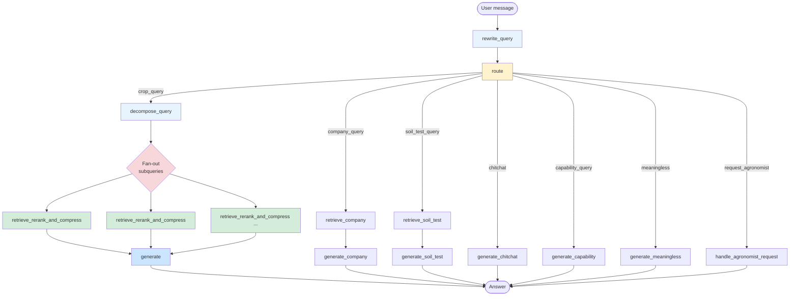
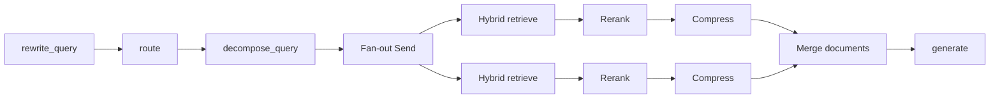

# Aunkur AI — Agricultural RAG Chatbot

Grounded crop-advisory assistant for farmers in Bangladesh. Answers questions about crop production, pests, diseases, fertilizers, irrigation, soil testing, and company information in Bangla and English using retrieval-augmented generation.

---

## Features

- **Multi-intent LangGraph pipeline** — rewrite → route → decompose → parallel retrieve/rerank/compress → generate
- **Bangla / Banglish / English** support with history-aware query rewriting
- **Entity-aware query decomposition** with parallel fan-out retrieval
- **Hybrid retrieval** over Chroma collections + external reranker + LLM context compression
- **Separate knowledge bases** for crops, company info, and soil testing (Porokh)
- **Streaming and non-streaming** chat API
- **Multi-turn memory** via LangGraph checkpointer (in-memory or Redis)
- **Streamlit UI** for local demos
- **Pluggable LLM providers** — Ollama, vLLM, or Groq

---

## Architecture

### High-level flow

```text
Client (API / Streamlit)
        │
        ▼
   FastAPI  (/api/v1/chat, /api/v1/chat/stream)
        │
        ▼
   LangGraph pipeline
        │
        ├── rewrite_query          History-aware coreference + Bangla normalization
        │
        └── route                  Intent classification
                 │
     ┌───────────┼───────────────────────────────────────────────┐
     │           │                       │              │         │
 crop_query  company_query         soil_test_query  chitchat  capability /
     │           │                       │              │      meaningless /
     │           │                       │              │   request_agronomist
     ▼           ▼                       ▼              ▼         ▼
decompose   retrieve_company      retrieve_soil_test  specialized generate nodes
     │           │                       │
     │           ▼                       ▼
     │      generate_company      generate_soil_test
     │
     ▼
fan-out subqueries (parallel)
     │
     ▼
retrieve_rerank_and_compress
     │
     ▼
generate  (grounded answer)
```

### Pipeline diagram (Mermaid)



### Crop-path detail



### Pipeline stages (crop path)

| Stage | Role |
|-------|------|
| **rewrite_query** | Resolves pronouns/coreferences from conversation history; converts Banglish → native Bangla script; preserves entity identity |
| **route** | Classifies intent: `crop_query`, `company_query`, `soil_test_query`, `chitchat`, `capability_query`, `meaningless`, `request_agronomist` |
| **decompose_query** | Splits multi-entity questions into subqueries while retaining shared context (crop + disease, etc.) |
| **retrieve_rerank_and_compress** | Hybrid retrieval → external reranker → LLM span extraction (runs in parallel per subquery) |
| **generate** | Produces a grounded, conversational answer in the user’s language; never invents rates or cites the context as a source |

Other intents bypass retrieval and go to dedicated generation nodes.

The graph is defined in `src/app/services/pipeline/graph.py`. Session ID is used as the LangGraph thread ID for multi-turn context.

---

## Tech stack

| Layer | Technology |
|-------|------------|
| API | FastAPI |
| Orchestration | LangGraph + LangChain |
| Vector store | Chroma |
| Embeddings | Ollama (`bge-m3`) |
| Chat LLM | Ollama / vLLM / Groq (configurable) |
| Reranker | External HTTP service |
| UI | Streamlit |
| Checkpoint | Memory or Redis |
| Packaging | Python 3.11+, Docker Compose |

---

## Project structure

```text
src/app/
├── main.py                          FastAPI entrypoint
├── api/v1/endpoints/chat.py         Chat + streaming endpoints
├── core/config.py                   Environment-backed settings
├── services/
│   ├── chat_service.py              API ↔ graph orchestration
│   ├── llm/                         Chat & embedding clients
│   ├── pipeline/
│   │   ├── graph.py                 LangGraph assembly
│   │   ├── state.py                 Pipeline state
│   │   └── nodes/                   rewrite, route, decompose, retrieve, compress, generate, …
│   └── retrieval/                   Hybrid retriever, vector store helpers
├── ingestion/                       Index build scripts
└── schemas/                         Pydantic models
data/                                Source data & local Chroma (optional)
ui/streamlit_app.py                  Demo UI
tests/                               Unit & integration tests
```

---

## Quick start

### 1. Prerequisites

- Python 3.11+
- Access to:
  - Chroma (local or remote)
  - Ollama (embeddings; optionally chat)
  - Optional: vLLM chat server, external reranker, Redis

### 2. Install

```bash
python3 -m venv .venv
source .venv/bin/activate          # Windows: .venv\Scripts\Activate.ps1
pip install --upgrade pip
pip install -e ".[dev]"
```

### 3. Configure

Copy `.env.example` to `.env` and set at least:

```dotenv
CHAT_PROVIDER=ollama          # or vllm | groq
OLLAMA_CHAT_MODEL=gemma4:12b
OLLAMA_BASE_URL=http://localhost:11434
EMBED_MODEL=bge-m3:latest

CHROMA_HOST=127.0.0.1
CHROMA_PORT=8000
CHROMA_COLLECTION=crop_knowledge_base
CHROMA_COMPANY_COLLECTION=company_knowledge_base
CHROMA_SOIL_TEST_COLLECTION=soil_test_knowledge_base

RERANKER_URL=http://localhost:8090/rerank
CHECKPOINT_BACKEND=memory     # or redis
```

> **Note:** `get_settings()` is cached. Restart the process after changing `.env`.

### 4. Ingest knowledge

Ensure the embedding model is available:

```bash
ollama pull bge-m3
```

Reset and rebuild all collections:

```bash
python -m app.ingestion.build_index --fetch --reset
python -m app.ingestion.load_company_data --reset
python -m app.ingestion.load_soil_test_data --reset
```

| Collection | Source | Command |
|------------|--------|---------|
| `crop_knowledge_base` | GraphQL / `data/crops.json` | `python -m app.ingestion.build_index [--fetch] [--reset]` |
| `company_knowledge_base` | `data/aunkur_company_info.md` | `python -m app.ingestion.load_company_data [--reset]` |
| `soil_test_knowledge_base` | Porokh + soil FAQ CSVs | `python -m app.ingestion.load_soil_test_data [--reset]` |

### 5. Run

```bash
uvicorn app.main:app --host 0.0.0.0 --port 8000 --reload
```

- API docs: http://localhost:8000/docs  
- Streamlit UI: `streamlit run ui/streamlit_app.py` → http://localhost:8501  

---

## API

| Endpoint | Method | Description |
|----------|--------|-------------|
| `/api/v1/chat` | POST | Non-streaming chat |
| `/api/v1/chat/stream` | POST | Streaming chat (SSE) |
| `/health` | GET | Health check |

Typical request body:

```json
{
  "message": "বোরো ধানে ব্যাকটেরিয়াল লিফ ব্লাইট হলে কী করব?",
  "session_id": "optional-session-uuid"
}
```

`session_id` is reused as the LangGraph thread ID so conversation history is preserved across turns.

---

## Docker

The Compose stack runs the API, Streamlit UI, and Redis. Model services (vLLM / Ollama / Chroma / reranker) are expected on the host (e.g. via SSH tunnel).

```bash
# Example tunnel to remote model host
ssh -N \
  -L 8091:127.0.0.1:8091 \
  -L 8090:127.0.0.1:8090 \
  -L 11434:127.0.0.1:11434 \
  -L 8000:127.0.0.1:8000 \
  user@remote-host

docker compose up -d --build
```

- API: http://localhost:8000  
- UI:  http://localhost:8501  

Ingest inside the container:

```bash
docker compose exec app python -m app.ingestion.build_index --reset
docker compose exec app python -m app.ingestion.load_company_data --reset
docker compose exec app python -m app.ingestion.load_soil_test_data --reset
```

---

## Configuration reference

| Variable | Default | Description |
|----------|---------|-------------|
| `CHAT_PROVIDER` | `vllm` | `ollama` \| `vllm` \| `groq` |
| `OLLAMA_CHAT_MODEL` | `gemma4:31b-cloud` | Chat model when provider is Ollama |
| `VLLM_CHAT_MODEL` | `gemma4:12b` | Chat model when provider is vLLM |
| `VLLM_BASE_URL` | `http://localhost:8091/v1` | OpenAI-compatible vLLM endpoint |
| `EMBED_MODEL` | `bge-m3:latest` | Embedding model (Ollama) |
| `RETRIEVAL_TOP_K` | `20` | Initial retrieval depth |
| `RERANK_TOP_K` | `7` | Chunks kept after reranking |
| `COMPRESSION_MAX_TOKENS` | `1000` | Max tokens for context compression |
| `CHECKPOINT_BACKEND` | `redis` | `memory` \| `redis` |
| `RERANKER_URL` | `http://localhost:8090/rerank` | External reranker |

All settings are defined in `src/app/core/config.py` and loaded from `.env`.

---

## Testing

```bash
pytest -q
ruff check .
```

---

## Design notes

- **Each pipeline node is a narrow specialist.** Nodes do not know about other layers; they receive only the data they need and return a strict contract. This improves reliability on mid-size quantized models (e.g. Gemma 4 12B).
- **Query rewrite** normalizes language and resolves coreference but must not alter entity identity (crop, disease, chemical names).
- **Decomposition** splits only by entity and always preserves shared context across subqueries.
- **Generation** answers only from supplied context, speaks as a domain expert, and never attributes answers to “the provided information”.
- Answers are grounded but not a substitute for professional agronomic advice. Review critical recommendations before acting on them.

---

## Deployment notes

Cloud Build, Cloud Run, and Azure Container Apps deployment snippets used by the team are kept in `cloudbuild.yaml` and `containerapp.yaml`. Update image names, project IDs, and secrets for your environment before use.

---

## License

No license metadata is currently declared in this repository.
